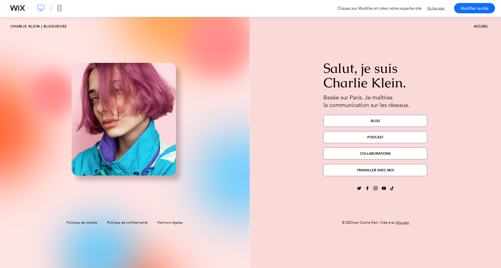
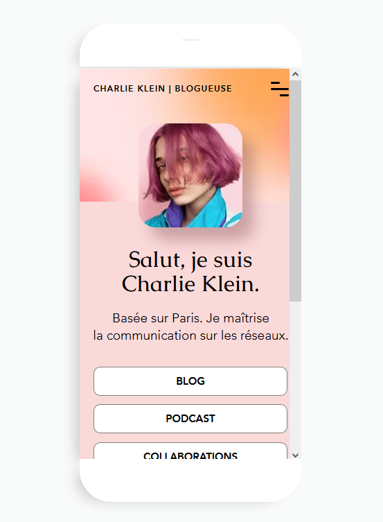
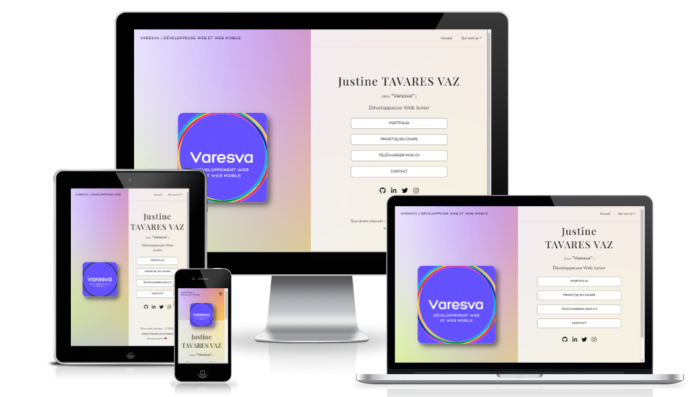

# Portfolio - idée n°1
Projet personnel : Exercice d'intégration HTML n°1.

## Sommaire

1. Description

2. Objectifs principaux

3. Outils

4. Apercus

5. Crédits

## Description
Ce projet est un exemple de site portfolio réalisé à titre d'entraînement.

> Retrouvez le projet en ligne à l'adresse suivante : [lien portfolio web](varesva-portfolio1-integration.pages.dev)
  
**Durée de réalisation**
Du 12/08/2022 au 15/08/2022

## Objectifs principaux

 * Chercher et intégrer une [maquette](https://fr.wix.com/website-template/view/html/2942?originUrl=https%3A%2F%2Ffr.wix.com%2Fwebsite%2Ftemplates%2Fhtml%2Fportfolio-cv&tpClick=view_button&esi=03da46a4-64ac-4ab8-8a2c-66969a64d369)

* Développer la partie front-end d’une application web/web mobile (personnalisation autorisée, framework et pré-compilateur non-autorisés)

* Réaliser une interface utilisateur web statique et adaptable (Responsive Design)

* Organiser les éléments (dossiers, fichiers, contenu) du projet

* Appliquer les bonnes pratiques du développement web et web mobile (W3C Compliance) et les principes de base du référencement SEO

* Assurer une compatibilité du site avec les dernières versions des navigateurs web Chrome et Firefox

### Aperçus
#### Aperçus maquette
* Version Desktop

* Version Mobile

#### Aperçus du site

## Outils

* **Éditeur de code** : Visual Studio Code (extensions installées : Live Server, Prettier)

* **Langages de programmation web** : HTML5, CSS3, JavaScript

* **Outil de gestion de version** : Github

### Crédits
- Modèle maquette : [Wix.com](https://fr.wix.com/)
- [AmIResponsive](https://ui.dev/amiresponsive)
- [Google Search Console](https://search.google.com/test/mobile-friendly)
- [Cloudfare](https://www.cloudflare.com)

